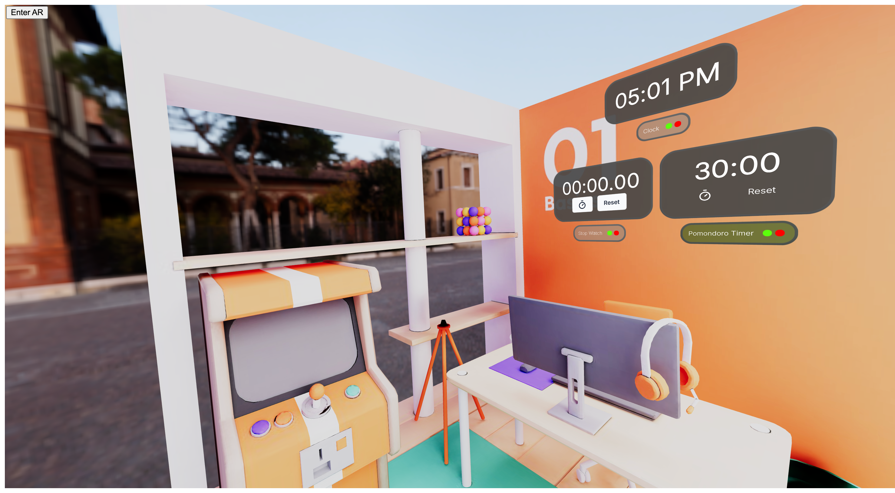

# SpatialJS Spatial Clock App Example

<p align="center">
  
</p>

<h3 align="center">Create an interactive spatial clock app</h3>

<br/>

Built with ❤️ by [Deamoner](https://twitter.com/spatialmatty) | [Personal Site](https://mattydavis.ca/) | [YouTube](https://www.youtube.com/@mattjdavis) | [Medium](https://medium.com/@mdavis-71283) | [Discord](https://discord.gg/tKNwtpDVJn)

## Live Demo

You can try out this project live on CodeSandbox:

[](https://codesandbox.io/p/github/Deamoner/spatialjs-clock-example/main?import=true)

This live demo allows you to explore the interactive spatial room with the wall-jumping a wall Clock and timer.

## Base Libraries

This project is built using the following:

- [SpatialJS](https://github.com/Deamoner/spatialjs) - A framework for building spatial user interfaces
- [@spatialjs/core](https://www.npmjs.com/package/@spatialjs/core) - Core package for SpatialJS
- [SpatialJS Documentation](https://spatialjs.dev/) - Official documentation and guides

These libraries provide the foundation for creating interactive 3D spatial environments with React and Three.js.

## Getting Started

1. Clone this repository
2. Install dependencies:

```bash
npm install
```

3. Run the development server:

```bash
npm run dev
```

Now you should be able to run the completed project without issue.
Let's look at how we did it.

## Project Build

This project uses Vite as the build tool. Here's how to set up the basic structure:

1. Initialize a new Vite project with React and TypeScript:

```bash
npm create vite@latest spatialjs-room-example -- --template react-ts
```

2. Install Dependencies:

```bash
npm install @react-three/fiber @react-three/drei @react-three/xr @react-three/uikit @spatialjs/core three
```

3. Setup your Basic App with a Canvas, OrbitControls, and XR:

```typescript:src/App.tsx
import { Canvas } from '@react-three/fiber';
import { OrbitControls, Preload, useGLTF } from '@react-three/drei';
import { XR } from '@react-three/xr';
import { WindowManager, createWindow, useWindowStore } from '@spatialjs/core';

const store = createXRStore({
  emulate: true,
  frameRate: 'high',
  foveation: 100,
});

const App: React.FC = () => {
  return (
    <Canvas>
      <XR store={store}>
        <OrbitControls />
      </XR>
    </Canvas>
  );
};
```

4. Setup your Basic Room with an environment and room mesh:
<p align="center">
  
</p>

```typescript:src/components/Room.tsx
import { useThree } from '@react-three/fiber'
import { useGLTF } from '@react-three/drei'
import { useEffect, useState, useCallback } from 'react'
import * as THREE from 'three'
import { useWindowStore } from '@spatialjs/core';

export function Room() {
    const { nodes } = useGLTF('/level-react-draco.glb');
    const [position, setPosition] = useState([0, -0.45, 0])
     return (
    <mesh
      key="room"
      scale={4.5}
      geometry={nodes.Level.geometry}
      material={nodes.Level.material}
      position={[position[0] - 1.75, -position[1], -position[2]]}
      rotation={[Math.PI / 2, -Math.PI / 9, 0]}
      onClick={handleClick}
      pointerEventsType={{ deny: ["grab", "touch"] }}
    />
  )
}
```

5. Create the Different Clock Types and UI:

```typescript:src/components/Clock.tsx
import React, { useState, useEffect } from "react";
import { Text } from "@react-three/uikit";

interface ClockProps {
  disableSeconds?: boolean;
}

const Clock: React.FC<ClockProps> = ({ disableSeconds = false }) => {
  const [time, setTime] = useState(new Date());

  useEffect(() => {
    const timer = setInterval(() => {
      setTime(new Date());
    }, 1000);

    return () => {
      clearInterval(timer);
    };
  }, []);

  const formatTime = (date: Date) => {
    return date.toLocaleTimeString([], {
      hour: "2-digit",
      minute: "2-digit",
      second: disableSeconds ? undefined : "2-digit",
    });
  };

  return <Text fontSize={45}>{formatTime(time)}</Text>;
};

export default Clock;

```

```typescript:src/components/StopClock.tsx
import React, { useState, useEffect } from "react";
import { Text, Container } from "@react-three/uikit";
import { Input } from "./apfel/input";
import { Button } from "./default/button";
import { Timer, TimerOff } from "@react-three/uikit-lucide";

const StopWatch: React.FC = () => {
  const [time, setTime] = useState(0);
  const [isRunning, setIsRunning] = useState(false);

  useEffect(() => {
    let intervalId: any;
    if (isRunning) {
      intervalId = setInterval(() => {
        setTime((prevTime) => prevTime + 10);
      }, 10);
    }
    return () => clearInterval(intervalId);
  }, [isRunning]);

  const startStop = (e: any) => {
    e.stopPropagation();
    setIsRunning(!isRunning);
  };

  const reset = (e: any) => {
    e.stopPropagation();
    setTime(0);
    setIsRunning(false);
  };

  const formatTime = (ms: number) => {
    const minutes = Math.floor(ms / 60000);
    const seconds = Math.floor((ms % 60000) / 1000);
    const centiseconds = Math.floor((ms % 1000) / 10);
    return `${minutes.toString().padStart(2, "0")}:${seconds
      .toString()
      .padStart(2, "0")}.${centiseconds.toString().padStart(2, "0")}`;
  };

  return (
    <Container spacing={2} width={200} flexDirection="column">
      <Container gap={12} flexgrow={1} justifyContent="center">
        <Text fontSize={45}>{formatTime(time)}</Text>
      </Container>
      <Container spacing={2} gap={12} flex-grow={1} justifyContent="center">
        <Button type="button" onClick={startStop}>
          {isRunning ? <TimerOff /> : <Timer />}
        </Button>
        <Button type="button" onClick={reset}>
          <Text>Reset</Text>
        </Button>
      </Container>
    </Container>
  );
};

export default StopWatch;


```

```typescript:src/components/Pomondoro.ts
import React, { useState, useEffect } from "react";
import { Text, Container } from "@react-three/uikit";
import { Button } from "@react-three/uikit-apfel";
import { Timer, TimerOff } from "@react-three/uikit-lucide";

const Pomondoro: React.FC = () => {
  const [time, setTime] = useState(30 * 60 * 1000); // 30 minutes in milliseconds
  const [isRunning, setIsRunning] = useState(false);

  useEffect(() => {
    let intervalId: any;
    if (isRunning && time > 0) {
      intervalId = setInterval(() => {
        setTime((prevTime) => prevTime - 10);
      }, 10);
    } else if (time === 0) {
      setIsRunning(false);
    }
    return () => clearInterval(intervalId);
  }, [isRunning, time]);

  const startStop = (e: any) => {
    e.stopPropagation();
    setIsRunning(!isRunning);
  };

  const reset = (e: any) => {
    e.stopPropagation();
    setTime(30 * 60 * 1000);
    setIsRunning(false);
  };

  const formatTime = (ms: number) => {
    const minutes = Math.floor(ms / 60000);
    const seconds = Math.floor((ms % 60000) / 1000);
    return `${minutes.toString().padStart(2, "0")}:${seconds
      .toString()
      .padStart(2, "0")}`;
  };

  return (
    <Container spacing={2} width={200} flexDirection="column">
      <Container gap={12} flex-grow={1} justifyContent="center">
        <Text fontSize={45}>{formatTime(time)}</Text>
      </Container>
      <Container spacing={2} gap={12} flex-grow={1} justifyContent="center">
        <Button type="button" onClick={startStop}>
          {isRunning ? <TimerOff /> : <Timer />}
        </Button>
        <Button type="button" onClick={reset}>
          <Text>Reset</Text>
        </Button>
      </Container>
    </Container>
  );
};

export default Pomondoro;

```

6. Now add the windows when the app starts, add the following to the App.tsx file:

```typescript:src/App.tsx
useEffect(() => {
    createWindow(Clock, {
      id: "clock",
      title: "Clock",
      props: { disableSeconds: true },
      disableBackground: false,
      followCamera: true,
      disableTiling: true,
      position: new THREE.Vector3(
        0.7054231986607751,
        5.388817243461132,
        -6.841060185432433
      ),
    });

    createWindow(StopWatch, {
      id: "StopWatch",
      title: "Stop Watch",
      props: { disableSeconds: true },
      disableBackground: false,
      followCamera: true,
      disableTiling: true,
      position: new THREE.Vector3(
        -0.7054231986607751,
        3.288817243461132,
        -6.841060185432433
      ),
    });

    createWindow(Pomodoro, {
      id: "Pomondoro",
      title: "Pomondoro Timer",
      props: { disableSeconds: true },
      disableBackground: false,
      followCamera: true,
      disableTiling: true,
      position: new THREE.Vector3(
        1.9054231986607751,
        3.288817243461132,
        -6.841060185432433
      ),
    });
  }, []);
```

7. For interactions to allow the players to move around the room add the following to the Room Mesh:

```typescript:src/components/Room.tsx
const [position, setPosition] = useState([0, -0.45, 0])
  const { setPosition: setWindowPosition, setRotation: setWindowRotation, lastWindow } = useWindowStore();

  const handleClick = useCallback((event: any) => {
    event.stopPropagation()
    console.log(event);
    // Calculate surface normal at the click point
    const face = event.face
    const normal = face.normal.clone()
    normal.transformDirection(event.object.matrixWorld)

    // Calculate a point slightly in front of the clicked point along the surface normal
    const offsetDistance = 0.1 // Adjust this value as needed
    const offsetPoint = event.point.clone().add(normal.multiplyScalar(offsetDistance))

    // Calculate rotation to face outward from the surface
    const rotationMatrix = new THREE.Matrix4().lookAt(normal, new THREE.Vector3(0, 0, 0), new THREE.Vector3(0, 1, 0))
    const rotation = new THREE.Euler().setFromRotationMatrix(rotationMatrix)

    console.log('Room clicked!', offsetPoint)
    if (lastWindow) {
      setWindowPosition(lastWindow, offsetPoint)
      setWindowRotation(lastWindow, rotation)
      useWindowStore.getState().updateWindow(lastWindow, {
        disableTiling: true,
        position: offsetPoint,
        rotation: rotation
      });
    }
  }, [setWindowPosition, setWindowRotation, lastWindow])
```

## Support

For questions, bug reports, or feature requests, please open an issue on our [GitHub repository](https://github.com/Deamoner/spatialjs).

---

Built with ❤️ by [Deamoner](https://twitter.com/spatialmatty) | [Personal Site](https://mattydavis.ca/) | [YouTube](https://www.youtube.com/@mattjdavis) | [Medium](https://medium.com/@mdavis-71283) | [Discord](https://discord.gg/tKNwtpDVJn)
